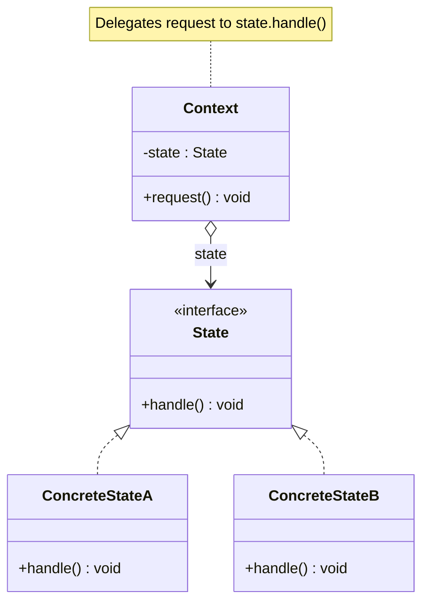

### State design pattern

```mermaid
classDiagram
    class Context {
        -state : State
        +request() void
    }

    class State {
        <<interface>>
        +handle() void
    }

    class ConcreteStateA {
        +handle() void
    }

    class ConcreteStateB {
        +handle() void
    }

Context o--> State : state
State <|.. ConcreteStateA
State <|.. ConcreteStateB

note for Context "Delegates request to state.handle()"
```
